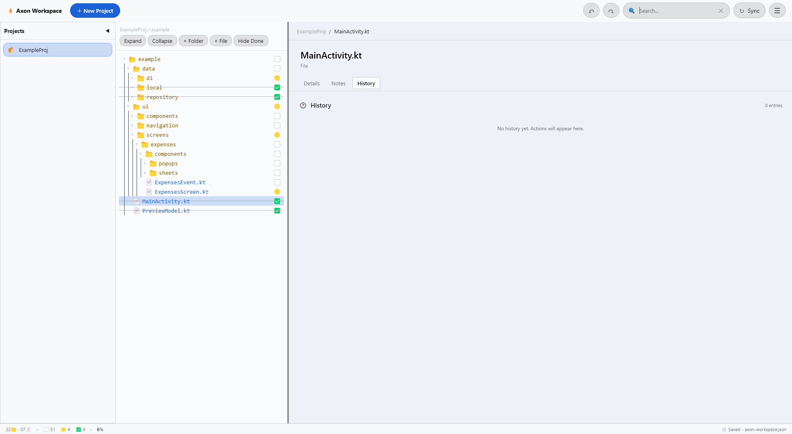
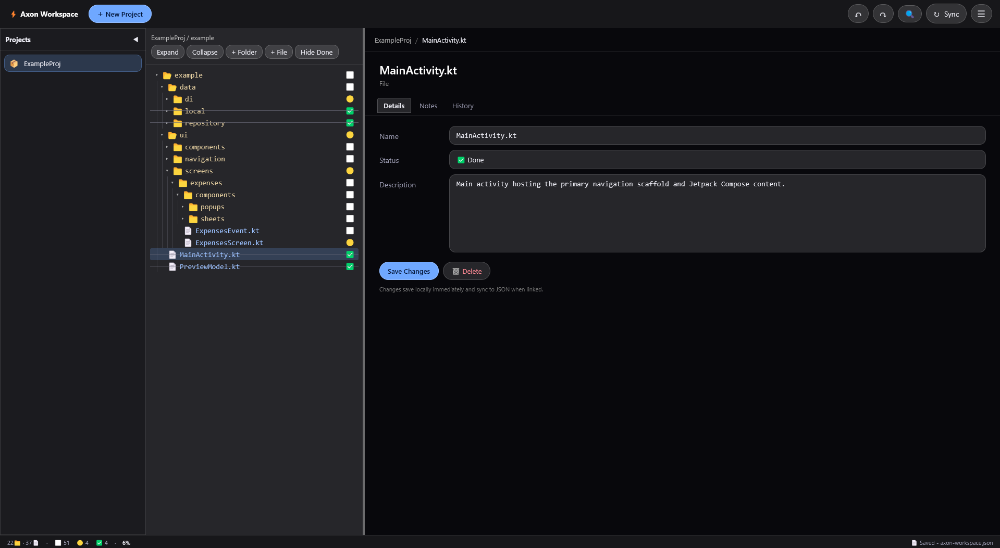

<div align="center">

# Axon Workspace

### A desktop workspace for designing, organizing, and tracking software project architecture.


**Open Source • Desktop • AI-assisted**

</div>

---

## Overview

**Axon Workspace** is a desktop tool for designing and tracking software project architecture as an interactive tree.

Instead of manually drawing project structures or repeatedly navigating through folders and files, the project can be represented visually and followed item by item.

Each folder and file can have its own status, description, notes, and implementation ideas, making it easier to follow a project from its initial architecture through development.

---

## Purpose

Designing and maintaining a software architecture manually can take a significant amount of time, especially when a project contains many folders and files.

The workspace can be used to:

- Design the project structure before implementation
- Track the status of folders and files
- Describe the purpose of individual files and folders
- Keep notes and implementation ideas alongside the structure
- Search and navigate large project trees quickly

---

## AI-Assisted Workflow

A project architecture can be generated by an AI agent and imported directly into the workspace.

### From an Idea

Describe the project idea to an AI agent and provide the [AI Architecture Prompt](docs/AI_ARCHITECTURE_PROMPT.md).

The agent can generate a complete proposed architecture including folders, files, descriptions, and other relevant structure.

Save the generated response as:

```text
axon-workspace.json
```

Then use **Import** to load it into the application.

### From an Existing Project

Provide the complete project as a ZIP/archive together with the [AI Architecture Prompt](docs/AI_ARCHITECTURE_PROMPT.md).

The AI agent analyzes the actual project structure and generates an `axon-workspace.json` file based on the files and folders that actually exist.

The generated file can then be imported into the application.

### Workflow

```text
Project Idea / Existing Project
              ↓
          AI Agent
              ↓
      axon-workspace.json
              ↓
            Import
              ↓
        Axon Workspace
              ↓
   Track + Describe + Update
```

---

## Workspace Files

The workspace can be managed through JSON files:

- **Import** — Imports an existing `axon-workspace.json` into the application.
- **Save JSON** — Creates a complete copy of the current workspace data as `axon-workspace.json`.
- **Open JSON** — Opens a workspace from an existing JSON file.

A saved workspace can be moved to another location and opened again when needed.

> **Important:** Once a JSON workspace is linked to the application, it is kept in sync with the workspace. Changes made in the application are reflected in the linked JSON file.

---

## Features

- Hierarchical project tree with folders and files
- Status tracking
    - Not Started
    - In Progress
    - Done
- File and folder descriptions
- Notes and History
- Smart search with animated tree expansion
- Light, Dark, and Auto themes
- Customizable keyboard shortcuts
- JSON workspace linking and live synchronization
- Import and export through JSON
- Local and portable workspace data
- Glassmorphism UI inspired by Samsung One UI

---

## Screenshots

<p align="center">
  
</p>

<p align="center">
  
</p>

---

## Built With


---

## Requirements

- JDK 21
- Gradle 8.10+

---

## Run

```bash
./gradlew run
```

---

## Build

On Windows from the project root:

```powershell
$env:JAVA_HOME = "C:\Program Files\Eclipse Adoptium\jdk-21.0.12.101-hotspot"
$env:Path = "$env:JAVA_HOME\bin;" + $env:Path
.\gradlew.bat createDistributable
```

The distributable application is generated under:

```text
build/compose/binaries/main/app/
```

---

## Data Storage

After creating the distributable application, local application data is stored in the `data` directory next to the executable:

```text
AxonWorkspace/
├── AxonWorkspace.exe
└── data/
    └── .axon-data/
```

The `.axon-data` directory contains the application's internal workspace data.

---

## Project History

Axon Workspace originally started as an HTML/JavaScript project and was later fully migrated to Kotlin and Compose for Desktop.

The idea, requirements, and overall direction were provided by me. The implementation from 0 to 100 was done through AI-assisted coding. My role was to guide and monitor the development, review the UI/UX, test the application, and validate the final result.

---

## Open Source

This project is fully open source and licensed under the MIT License.